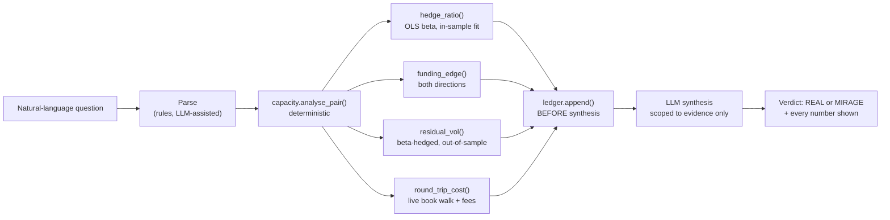

# Reef

**Is this tokenized-equity funding yield actually an opportunity, or does it only look like one?**

Bitget lists 321 perpetual contracts flagged `isRwa: YES` — tokenized US
equities, ETFs, indices, and leveraged products, trading 24/7 against
underlyings that close for two days a week. A funding-yield screen will
show you a wall of attractive-looking numbers. Reef prices each one for
real execution cost and residual risk, and tells you which ones survive.

Built for Bitget AI Base Camp Hackathon S2 · Track 3, AI Trading Desk ·
Open Theme.

**[Live demo](https://claude.ai/code/artifact/6c4715c5-1b92-40f2-a7dd-2246c66afb1f)** · [Findings](#findings) · [Architecture](#architecture) · [Evidence](evidence/README.md) · [Decisions](DECISIONS.md) · [Limitations](LIMITATIONS.md)

---

## Who this is for

Retail and semi-professional RWA-perp traders sizing $1k–$250k, holding
positions for days to a couple of months, who look at a funding-rate screen
and have no way to tell which of those numbers would actually survive
opening the position. Not a market-maker (this doesn't quote or provide
liquidity) and not an institutional desk (no portfolio margin, no prime
brokerage integration) — the person this is built for is the one currently
making that call by eyeballing a gross-yield column.

## Explore without running anything

| Open | Ask / look for | What it establishes |
|---|---|---|
| [Live demo](https://claude.ai/code/artifact/6c4715c5-1b92-40f2-a7dd-2246c66afb1f) | "Is SMH/SOXL real for $25k over 30 days?" | The naive #1 pick by gross yield (17.7%) prices to Sharpe 0.05 |
| Same page | Click **XAU/XAUT** in the index table | The one pair (of 18) that survives pricing, and why |
| Same page | Capacity-curve panel | Net return by size × holding period, drawn to scale, naive pick vs. actual winner overlaid |
| [`evidence/screen_*.txt`](evidence/) | — | Raw, re-runnable output of the naive-vs-priced inversion |
| [`evidence/funding_regime_*.txt`](evidence/) | — | Funding edge collapsing 7× from US market hours to weekend |

The demo's query box asks Claude directly (the artifact's `sample`
capability — no API key required to try it) to explain an
already-priced verdict, scoped so it can't invent a number. See
[Architecture](#architecture) for how that boundary is enforced.

## Findings

18 same-underlying RWA pairs, priced at $25k / 30-day hold, 83 days of
hourly price history (out-of-sample split), ~33 days of funding history:

- **1 of 18 clears Sharpe 0.5.** XAU/XAUT: 7.0% gross → 3.6% net,
  Sharpe 1.46, 68% same-sign funding consistency, 27.5bp round-trip cost.
- **The naive and priced rankings invert at the top.** Naive #1 by gross
  yield (SMH/SOXL, 17.7%) prices to **Sharpe 0.05** — its residual spread
  volatility is 76bp/hr, so 30-day risk is 2,048bp against 29bp of net
  carry. Naive #8 (XAU/XAUT) is the only real trade in the set.
- **Signal-to-noise degrades ~20× from US market hours to weekend.** Two
  independent measurements move together: tracking error (÷ own
  volatility) rises 2.89× (RTH 0.56 → weekend 1.55, 26/27 pairs
  weekend-worst), and funding edge falls 7× (RTH 1.36 bp/interval →
  weekend 0.19). The hackathon's own framing — that round-the-clock
  trading is the opportunity — is the opposite of what this data shows for
  these instruments.
- **2-sigma dislocations revert reliably (65–66%) in every regime**, but
  24bp of round-trip taker cost consumes the reversion entirely (net
  -2 to -10bp across regimes). At maker fees, weekend flips to +14bp net —
  the edge lives entirely inside the spread.
- **For the one surviving pair, holding period — not size — is the
  binding constraint.** XAU/XAUT breaks even at 13.1 days; cost only rises
  25.0 → 37.1bp from $1k to $250k.

Full methodology, what each number does and doesn't mean, and the
regression tests behind them: [`DECISIONS.md`](DECISIONS.md),
[`LIMITATIONS.md`](LIMITATIONS.md).

## The model

Three P&L components price every pair. Only two scale with holding period:

| Component | Scales with holding period | Source |
|---|---|---|
| Funding carry | yes, linearly | `history-fund-rate`, 8h intervals |
| Residual spread drift (risk) | yes, as √t | hourly closes, beta-hedged |
| Execution cost | **no — paid once** | live order-book walk + taker fees |

That asymmetry is the whole point: a trade that loses money round-tripped
every six hours can make money held for a month, and the capacity curve is
where those two facts meet.

Risk is the residual spread, **not** funding volatility — pricing SMH/SOXL
on funding volatility alone gives Sharpe ~5.1; pricing the risk actually
being carried gives 0.05. See [`DECISIONS.md`](DECISIONS.md#risk-is-the-residual-spread-not-funding-volatility)
for why.

## Architecture



The pricing math is pure deterministic arithmetic and runs identically with
or without an LLM available — `llm.py`'s template fallback proves this by
construction. The LLM's only two jobs are parsing free text into a
structured query, and explaining an already-computed verdict in prose,
under a system prompt that restricts it to fields already present in the
evidence object. It cannot compute, round differently, or introduce a
number that wasn't already there.

The web demo (`web/index.html`) doesn't reimplement this model in
JavaScript — `export_web.py` runs the real Python pipeline and exports a
precomputed grid the page looks up against, so the browser can never
silently diverge from the validated model. See
[`DECISIONS.md`](DECISIONS.md#the-web-demo-ports-the-pricing-models-output-not-its-code).

## What's delivered vs. not

| | Delivered | Notes |
|---|---|---|
| Deterministic carry/risk/cost model | ✅ | `model.py`, `capacity.py` |
| Public pair index with a real score | ✅ | `mirage_index.py` |
| Natural-language query interface | ✅ | `verdict.py` (CLI), `web/index.html` (live demo) |
| LLM synthesis, scoped to evidence | ✅ | Claude via artifact `sample`, Qwen via `llm.py` |
| Self-scoring ledger | ✅ built, unmatured | `ledger.py` + `score.py` — verdicts log before synthesis; none have reached their holding period yet |
| Live order-book / funding recorder | ✅ running | `recorder.py`, self-healing via `run_recorder.sh` |
| Adverse-selection (gap vs. depth) analysis | ⚠️ correct, thin sample | See [`evidence/README.md`](evidence/README.md) — 8 snapshots isn't enough to trust yet |
| Agent Hub paper-trading integration | ❌ not possible | Bitget's Demo environment has no tokenized-equity instrument (see `LIMITATIONS.md`) |
| Hedge-survival / margin simulation | ❌ abandoned | Required a spot leg that doesn't exist on Bitget — see `DECISIONS.md` |

## Run it

```bash
# Everything below runs against cached data in data/ — no network required
python src/screen.py          # naive vs priced ranking
python src/mirage_index.py    # full public index
python src/capacity.py        # capacity curve, all pairs
python src/funding_regime.py  # regime-dependence finding
python src/verdict.py "Is XAU/XAUT real for $50k over 2 weeks?"
python src/demo.py            # full walkthrough

python src/test_llm_parsing.py  # regression tests (CI runs this on every push)
```

To refresh the cached market data or run the live recorder, see the
scripts in `src/` — each has its own docstring describing what it pulls
and from where.

## Repository map

```
src/
  model.py, capacity.py       deterministic pricing model
  screen.py, mirage_index.py  naive-vs-priced ranking, public index
  llm.py, verdict.py          NL parsing + synthesis, orchestration
  ledger.py, score.py         self-scoring
  funding_regime.py           regime-dependence analysis
  adverse_selection.py        gap-vs-depth (needs live recorder data)
  recorder.py, run_recorder.sh  live capture, self-healing wrapper
  export_web.py               precomputed grid for the web demo
  test_llm_parsing.py         regression tests
web/
  index.html                  the live demo (also published as an artifact)
data/                         cached prices, funding, depth, live timeseries
evidence/                     committed, re-runnable pipeline output
.github/workflows/ci.yml      runs the pipeline + tests on every push
DECISIONS.md, LIMITATIONS.md  why things are built this way, and what isn't
```
