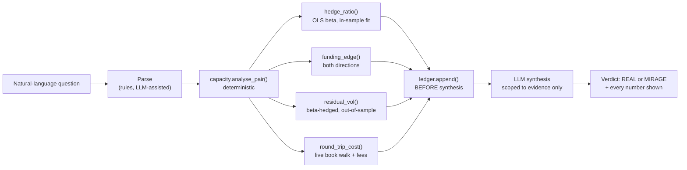

<div align="center">

# Reef

### Is this tokenized-equity yield real, or does it only look real?

[](https://github.com/IamHarrie-Labs/reef/actions/workflows/ci.yml)
[](evidence/)
[](#the-headline-result)
[](data/ledger.jsonl)
[](src/test_llm_parsing.py)

Bitget lists **321 perpetual contracts flagged `isRwa: YES`** — tokenized US equities, ETFs, indices and leveraged products, trading 24/7 against underlyings that close for two days a week. A funding-yield screen shows a wall of attractive numbers. Reef prices each one against real execution cost and residual risk, and tells you which survive.

Built for Bitget AI Base Camp Hackathon S2 · Track 3, AI Trading Desk · Open Theme.

**[Live demo](https://claude.ai/code/artifact/6c4715c5-1b92-40f2-a7dd-2246c66afb1f)** · [Verify it yourself](#verify-it-yourself-in-60-seconds) · [The finding](#the-finding-the-top-of-the-ranking-is-where-the-evidence-is-thinnest) · [Evidence](evidence/) · [Architecture](ARCHITECTURE.md) · [Decisions](DECISIONS.md) · [Limitations](LIMITATIONS.md)

</div>

---

## Verify it yourself in 60 seconds

No API key, no account, no network. Every number in this README regenerates from cached data committed in this repository:

```bash
git clone --depth 1 https://github.com/IamHarrie-Labs/reef && cd reef

python src/test_llm_parsing.py   # 9 parser regression tests, ~1s
python src/screen.py             # naive yield ranking vs fully-priced ranking
python src/edge_decay.py         # the winner's-curse result, both funding windows
python src/mirage_index.py       # all 25 pairs scored
python src/intervals.py          # 95% CIs, Wilson intervals, autocorrelation
python src/regime_test.py        # significance tests on both regime claims
```

Ask it something in plain English:

```bash
python src/verdict.py "Is SMH/SOXL real for $25k over 30 days?"
```

Every verdict prints the complete evidence object first — **every number the explanation is permitted to use** — then the verdict. The LLM never sees a figure it can restate incorrectly, because it is handed the arithmetic already done.

## Contents

- [The problem](#the-problem)
- [What Reef is](#what-reef-is)
- [The headline result](#the-headline-result)
- [The finding: the top of the ranking is where the evidence is thinnest](#the-finding-the-top-of-the-ranking-is-where-the-evidence-is-thinnest)
  - [The selected pair decayed hardest](#the-selected-pair-decayed-hardest)
  - [Why: half the history, a third of the sample](#why-half-the-history-a-third-of-the-sample)
- [Who this is for](#who-this-is-for)
- [Explore without running anything](#explore-without-running-anything)
- [Regime dependence](#regime-dependence)
- [The model](#the-model)
- [Architecture](#architecture)
- [Engineering decisions & the hard problems](#engineering-decisions--the-hard-problems)
- [What's real, and what I deliberately did not claim](#whats-real-and-what-i-deliberately-did-not-claim)
- [Run it](#run-it)
- [Project layout](#project-layout)

## The problem

A trader looking at RWA perpetual funding rates is shown gross yield and nothing else. The tooling around that number is thin in four specific ways:

- **Cost is invisible.** A 30% gross annualised yield on a pair whose round-trip execution costs 115bp is not a 30% trade, and no screen says so.
- **Risk is mismeasured.** Funding volatility is not the risk being carried — the beta-hedged price spread is, and it is roughly two orders of magnitude larger.
- **Capacity is unstated.** A yield that exists at $1,000 may not exist at $100,000, and the book decides that, not the funding rate.
- **Nothing is graded.** A screen that recommended a trade last month has no record of whether it was right, and no incentive to keep one.

## What Reef is

A pricing engine that takes a plain-English question about an RWA perpetual pair and returns a verdict with every number it used. The loop:

<div align="center">

**`ASK → PRICE → FREEZE → EXPLAIN → GRADE`**

</div>

1. **Ask** — free text in. A rule-based parser (LLM-assisted when a key is configured) resolves the pair, notional and holding period.
2. **Price** — deterministic arithmetic only: OLS hedge ratio fitted in-sample, funding differential in both directions, beta-hedged residual volatility, and a live order-book walk for execution cost.
3. **Freeze** — the verdict is appended to an immutable ledger **before** any language model sees it, so a later grade checks a prediction fixed before its outcome existed.
4. **Explain** — the LLM receives the finished evidence object and a system prompt restricting it to fields already present. It cannot compute, re-round, or introduce a figure.
5. **Grade** — once a verdict's holding period elapses, `score.py` scores it against realised prices. 52 verdicts at 1- and 3-day holds are currently maturing.

## The headline result

**2 of 25 pairs clear Sharpe 0.5 on their point estimate — and neither is distinguishable from zero.**

| Pair | Sharpe | 95% CI | Funding history | Effective sample |
|---|---:|---:|---:|---:|
| XAU/XAUT | **1.75** | [−0.38, +3.87] | 16.5 days | 30 |
| XAU/PAXG | **0.78** | [−2.09, +3.66] | 16.5 days | 21 |
| SMH/SOXL *(best equity pair)* | 0.21 | [−0.15, +0.58] | 33 days | 98 |

The two pairs at the top of the ranking are **the two with the least evidence behind them**. Both are gold; both settle funding every 4 hours instead of 8, so the endpoint's 100 intervals cover half the calendar span; and both are strongly autocorrelated, so those 100 intervals carry the information of about 21–30. Their intervals are wide enough to include zero.

The best equity-RWA pair, SMH/SOXL, has three times the effective sample and a far tighter interval — and a 30.1% gross annualised yield that prices to 0.21 once 2,159bp of 30-day residual-spread risk is charged against it.

Every one of the 52 verdicts logged at 1- and 3-day holds priced **MIRAGE**. That is the model's core asymmetry working rather than failing: execution cost is paid once, so a holding period too short for carry to accumulate past it can never be viable.

> **Correction.** Earlier versions of this README reported **0 of 25** clearing the bar, with XAU/XAUT at Sharpe 0.21. That was a bug: the model assumed every contract settles funding every 8 hours, but Bitget's gold contracts settle every **4**. Gold's carry was understated by exactly half. The bug and how it was found are in [`DECISIONS.md`](DECISIONS.md) D-15.

## The finding: the top of the ranking is where the evidence is thinnest

### The selected pair decayed hardest

Bitget's funding endpoint serves only the most recent 100 intervals, so every refresh rolls the window forward and becomes an **unplanned out-of-sample test**. Comparing the window ending 2026-09-16 with the one ending 09-21 — same pair, same model, same hedge ratio, nothing re-fitted:

| XAU/XAUT | earlier window | current window |
|---|---:|---:|
| Gross annualised | 13.9% | 7.7% (**56% retained**) |
| Funding consistency | 68% | 57% |
| Residual vol | 2.66 bp/hr | 2.69 bp/hr (unchanged) |
| **Sharpe** | **4.21** | **1.75** |

The carry decayed by nearly half. The risk did not move.

Meanwhile **the rest of the book held**: median gross edge retained across the 18 pairs priced on both windows was **99%**, with 12 of 18 keeping more than 80%. The pair that decayed hardest was the one the model ranked first.

That is the shape of the winner's curse — the top-ranked estimate is the one most inflated by sampling noise, so it has the furthest to fall. It still clears the bar at 1.75. But a Sharpe that more than halves across two windows overlapping by two weeks is not a number to size a position on.

Reproduce with [`src/edge_decay.py`](src/edge_decay.py). Both windows ship in the repo (`data/funding`, and `data/funding_prev` recovered from git history).

### Why: half the history, a third of the sample

The decay is explained by how little information sits behind gold's numbers. Funding intervals are autocorrelated, so the effective sample is smaller than the count. Adjusting by lag-1 autocorrelation, `n_eff = n·(1−r)/(1+r)`:

| Pair | Settles every | History | r₁ | **n_eff** | Sharpe 95% CI |
|---|---:|---:|---:|---:|---:|
| XAU/XAUT | 4h | 16.5 d | +0.53 | **30** | [−0.38, +3.87] |
| XAU/PAXG | 4h | 16.5 d | +0.65 | **21** | [−2.09, +3.66] |
| XAUT/PAXG | 4h | 16.5 d | +0.50 | **33** | [−1.49, +0.31] |
| SMH/SOXL | 8h | 33 d | +0.01 | 98 | [−0.15, +0.58] |
| QQQ/TQQQ | 8h | 33 d | −0.09 | 100 | [−0.29, +0.55] |
| SPY/VOO | 8h | 33 d | +0.11 | 80 | [−0.55, −0.43] |

Two separate things shrink gold's evidence, and they compound: **half the calendar span** (100 four-hourly settlements = 16.5 days), and **higher autocorrelation** (a third of the nominal sample survives adjustment).

**One caution on that autocorrelation.** Gold's r₁ is measured at a 4-hour lag and the equities' at 8 hours — rates sampled more often look more persistent simply because consecutive samples sit closer together. At a **matched 8-hour lag**, gold falls to **+0.32 to +0.41**, while equity pairs range from −0.09 to +0.20. Gold is more persistent, but by much less than the raw r₁ column suggests. The `n_eff` figures are still correct — they describe the samples as they actually exist — but "gold funding is intrinsically autocorrelated" would overstate it.

Reproduce with [`src/intervals.py`](src/intervals.py).

## Who this is for

Retail and semi-professional RWA-perp traders sizing **$1k–$250k**, holding days to a couple of months, who look at a funding-rate screen and cannot tell which numbers survive opening the position.

Not a market-maker (this does not quote or provide liquidity) and not an institutional desk (no portfolio margin, no prime brokerage). The person this is built for is the one currently making the call by eyeballing a gross-yield column.

## Explore without running anything

| Open | Ask / look for | What it establishes |
|---|---|---|
| [Live demo](https://claude.ai/code/artifact/6c4715c5-1b92-40f2-a7dd-2246c66afb1f) | "Is SMH/SOXL real for $25k over 30 days?" | The best-scoring pair in the book still prices to Sharpe 0.21 — a 30% gross yield not worth taking |
| Same page | Click **XAU/XAUT** in the index | The top-ranked pair — Sharpe 1.75, but a 95% interval that includes zero |
| Same page | Capacity-curve panel | Net return by size × holding period, drawn to scale |
| [`evidence/edge_decay_*.txt`](evidence/) | — | 99% median edge retained across the book, 56% for the top-ranked pair |
| [`evidence/regime_test_*.txt`](evidence/) | — | Both regime claims tested: tracking error 2.58× on weekends (p = 2.7×10⁻⁵), funding edge −2.57 bp/day (p = 0.036) |

## Regime dependence

Both claims below are tested as **paired comparisons across pairs** — sign test plus bootstrap intervals — in [`src/regime_test.py`](src/regime_test.py).

| Claim | Effect | 95% CI | Pairs agreeing | Exact p |
|---|---|---|---:|---:|
| Tracking error ÷ volatility is **higher** on weekends | **2.58×** weekend vs RTH | 2.1× – 3.1× | 25 / 28 | 2.7 × 10⁻⁵ |
| Funding edge is **lower** on weekends | **−2.57** bp/day | −3.86 to −1.38 | 20 / 28 | 0.036 |

- **Noise rises sharply.** The tracking-error result is the strongest in the project: 25 of 28 pairs go the same way, and the interval sits well clear of 1×.
- **Signal falls, more modestly.** The funding result is significant but weaker — 20 of 28 pairs, p = 0.036.
- The hackathon's framing — that round-the-clock trading is the opportunity — runs **opposite** to what this data shows for these instruments. When the underlying market shuts, noise rises and carry falls at the same time.

> **Correction.** An earlier version of this README reported the funding effect as a "23× decline". That was a ratio against a weekend mean near zero, and its bootstrap 95% interval ran from roughly **−150× to +150×**, which carries no information. Funding is now also compared in bp/day rather than bp/interval, since gold settles every 4 hours and equities every 8. The difference above is the defensible effect size. See [`DECISIONS.md`](DECISIONS.md) D-13.

## The model

Three P&L components. Only two scale with holding period:

| Component | Scales with holding period | Source |
|---|---|---|
| Funding carry | yes, linearly | `history-fund-rate`, 8h intervals |
| Residual spread drift (risk) | yes, as √t | hourly closes, beta-hedged |
| Execution cost | **no — paid once** | live order-book walk + taker fees |

That asymmetry is the whole point: a trade that loses money round-tripped every six hours can make money held for a month, and the capacity curve is where those two facts meet.

Risk is the residual spread, **not** funding volatility — pricing SMH/SOXL on funding volatility alone flatters it by roughly two orders of magnitude against the 0.21 it earns once residual-spread risk is charged. See [`DECISIONS.md`](DECISIONS.md).

## Architecture



The pricing math is pure deterministic arithmetic and runs identically with or without an LLM — `llm.py`'s template fallback proves this by construction.

The web demo does **not** reimplement the model in JavaScript. `export_web.py` runs the real Python pipeline and exports a precomputed grid the page looks up against, so the browser cannot silently diverge from the validated model.

## Engineering decisions & the hard problems

Full write-ups in [`DECISIONS.md`](DECISIONS.md). The ones that changed the result:

| Decision | Why it mattered |
|---|---|
| Risk priced on residual spread, not funding volatility | Changed SMH/SOXL's Sharpe by ~2 orders of magnitude. Getting this wrong makes every trade look viable. |
| Execution cost amortized once, not per interval | Makes the capacity curve non-trivial — the same trade flips viability between a 1-day and 30-day hold. |
| Hedge ratio fitted in-sample only, held fixed out-of-sample | Leveraged products recovering their true multiples out-of-sample (TQQQ 2.89, SOXS −3.72, TSLL 1.99) is what validated the pipeline. |
| Ledger written before LLM synthesis | A grade only means something if the prediction was frozen before the outcome existed. |
| The original hedge-survival concept was killed by a data check | All 2,241 Bitget spot symbols checked: zero RWA-linked. The concept required a spot leg that does not exist, so it was dropped rather than faked. |

## What's real, and what I deliberately did not claim

Full detail in [`LIMITATIONS.md`](LIMITATIONS.md).

**Real:** every price, funding rate and order book comes from Bitget's public endpoints. Nothing is synthetic or simulated. 117 days of hourly closes, 100 funding intervals, 25 pairs priced. The winner's-curse result is a genuine measurement on two real windows.

**Deliberately not claimed:**

- **No headline is a profitable strategy.** Two pairs clear the bar on their point estimate, but neither is statistically distinguishable from zero at 95%. This tool finds that most apparent edges are not real; it does not claim to have found one that is.
- **Gold's history is 16.5 days, not 5 weeks.** Gold settles funding every 4 hours, so the endpoint's 100 intervals cover half the span they do for equities.
- **The edge-decay windows overlap** by ~2 weeks. Directional evidence, not an independent test.
- **Execution cost rests on one book snapshot per pair**, taken during US regular hours — the most liquid window. Closed-market cost is measured separately in `cost_by_regime.py` and is still accumulating.
- **The adverse-selection question is open, not answered.** At the committed snapshot it had 8 data points. A correlation on 8 points is noise, and the evidence file says so rather than reporting a number.
- **Self-scoring has produced no grades yet.** 82 verdicts are logged; the 52 short-hold ones mature 09-22 and 09-24. Until then the self-scoring claim is a mechanism, not a result.
- **The reported intervals are a lower bound on uncertainty.** [`intervals.py`](src/intervals.py) propagates uncertainty in the funding edge only; execution cost and residual volatility are held at their point estimates. The true intervals are wider than printed.
- **Autocorrelation is corrected for at lag 1 only.** Higher-order structure would shrink the effective sample further, so `n_eff` is itself optimistic.

## Run it

```bash
# Everything below runs against cached data — no network required
python src/screen.py             # naive vs priced ranking
python src/mirage_index.py       # full public index, 25 pairs
python src/capacity.py           # capacity curve, all pairs
python src/edge_decay.py         # winner's-curse result across funding windows
python src/intervals.py          # confidence intervals on every headline number
python src/regime_test.py        # sign tests + bootstrap CIs on the regime claims
python src/funding_regime.py     # regime dependence
python src/verdict.py "Is XAU/XAUT real for $50k over 2 weeks?"
python src/demo.py               # full walkthrough

python src/test_llm_parsing.py   # 9 regression tests (CI runs these on push)
```

Live data (needs network):

```bash
python src/refresh.py            # refresh prices, funding, depth
sh src/run_recorder.sh &         # continuous book capture, self-healing
python src/cost_by_regime.py     # execution cost by regime, from recorder series
python src/score.py              # grade matured verdicts
```

## Claude Skill

[`.claude/skills/reef-pricer/SKILL.md`](.claude/skills/reef-pricer/SKILL.md) packages
`verdict.py` as a Claude Skill: point Claude Code at this repo and it can
answer "is this RWA pair's carry real" questions directly, scoped by an
explicit rule — every number in the answer must come from the evidence JSON
`verdict.py` prints, never invented or rounded by the model. It's the same
constraint the project enforces on itself (`DECISIONS.md` D-08): the pricer
decides what a number means, the language layer only reports it.

## Project layout

```
src/
  model.py, capacity.py         deterministic pricing model
  screen.py, mirage_index.py    naive-vs-priced ranking, public index
  llm.py, verdict.py            NL parsing + synthesis, orchestration
  ledger.py, score.py, log_batch.py   self-scoring
  edge_decay.py                 out-of-sample edge persistence
  intervals.py                  Wilson + autocorrelation-adjusted CIs
  regime_test.py                paired sign tests, bootstrap CIs on regime claims
  funding_regime.py             regime dependence
  adverse_selection.py          gap-vs-depth (needs recorder data)
  cost_by_regime.py             execution cost by regime
  depth_regime.py               open-vs-closed book comparison
  recorder.py, run_recorder.sh  live capture, self-healing wrapper
  refresh.py, export_web.py     data refresh, precomputed grid
  test_llm_parsing.py           regression tests
web/index.html                  the live demo
data/                           prices, funding (+ prior window), depth, timeseries
evidence/                       committed, re-runnable pipeline output
ARCHITECTURE.md                 the one rule, component map, verdict path
DECISIONS.md, LIMITATIONS.md    why it is built this way, and what it is not
```
