# Reef

**Look past the headline yield. See what holds up.**

**Live desk → [getreef.xyz](https://getreef.xyz)** · [Evidence](https://getreef.xyz/desk/evidence) · [Method](https://getreef.xyz/desk/method) · [Architecture](ARCHITECTURE.md) · [Decisions](DECISIONS.md) · [Limitations](LIMITATIONS.md) · [Validation](VALIDATION.md)

[](https://github.com/IamHarrie-Labs/reef/actions/workflows/ci.yml) [](https://github.com/IamHarrie-Labs/reef/actions/workflows/desk.yml)

Bitget AI Base Camp Hackathon S2 · Track 3, AI Trading Desk · Open theme

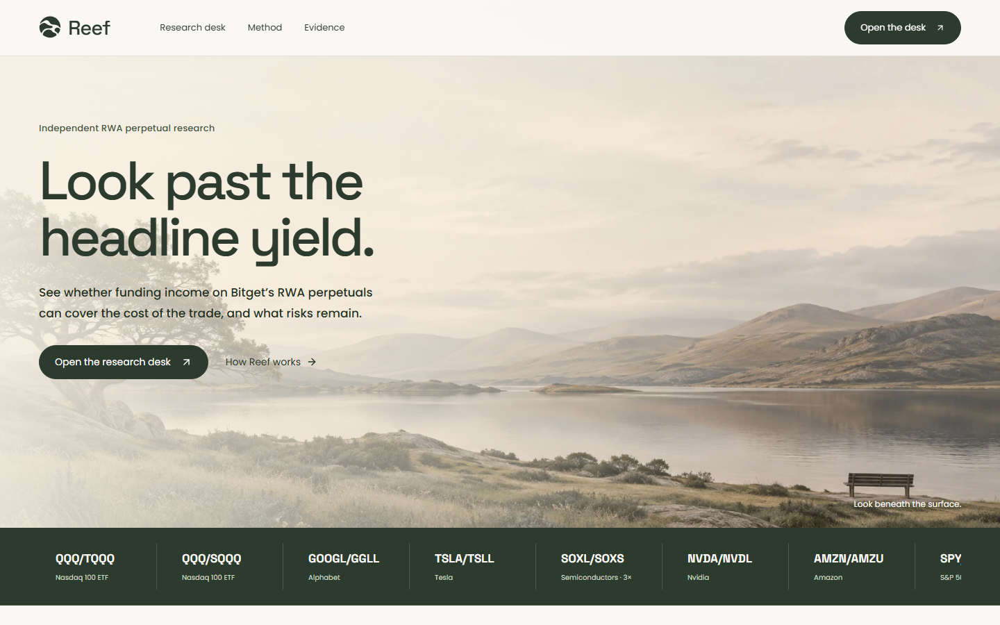

---

## Contents

1. [The problem](#the-problem)
2. [What Reef does, in one picture](#what-reef-does-in-one-picture)
3. [Architecture](#architecture)
4. [How one answer is made](#how-one-answer-is-made)
5. [A tour of the product](#a-tour-of-the-product)
6. [The evidence loop](#the-evidence-loop)
7. [Results so far, with baselines](#results-so-far-with-baselines)
8. [Verify it yourself](#verify-it-yourself)
9. [Run it locally](#run-it-locally)
10. [Repository map](#repository-map)
11. [What Reef does not claim](#what-reef-does-not-claim)

---

## The problem

Bitget lists perpetual futures on real-world assets: tokenized equities, ETFs, indices and gold. Pairs of them pay a funding differential that looks like free carry on a screen. Examples are SMH against SOXL, QQQ against TQQQ, and gold against tokenized gold.

The screen number leaves out three things:

- **Execution cost.** Two legs are entered and exited, each walking a real order book, with taker fees both ways.
- **Hedge risk.** A leveraged ETF and its underlying do not move one-for-one, so the "hedged" pair still carries residual spread risk.
- **Uncertainty.** A few weeks of funding history is a small sample. A good-looking average can be noise.

Reef is a research desk that prices all three for a specific size and holding period. It then gives a verdict you can audit, and tells you what would have to change for the trade to work.

**Who it is for:** experienced perpetual-futures traders comparing a two-legged Bitget RWA carry setup before opening it. The decision is concrete: at this size and hold, does the setup deserve more research, and which assumption would have to change? Reef never places an order and never asks for exchange keys.

## What Reef does, in one picture

Most pairs fail for the same reason. The funding is real, but it is tiny next to the cost of trading it.

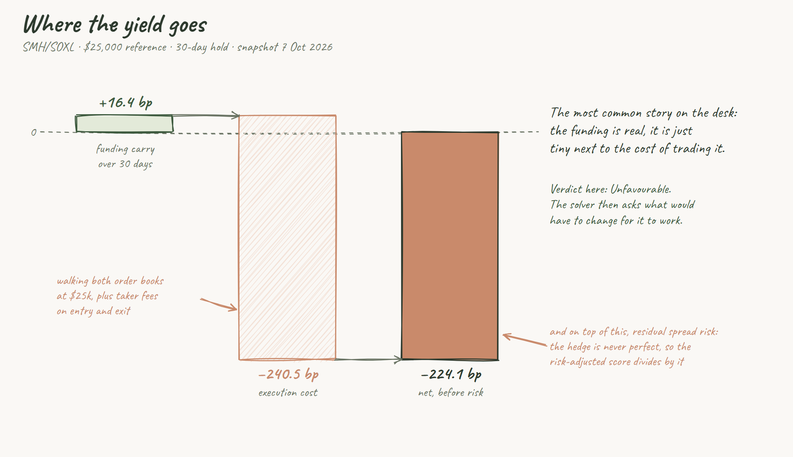

When a pair fails, Reef does not stop at "no". The solver ([`solve.py`](src/solve.py)) inverts the verdict and reports four things:

- the funding rate the trade would need
- the shortest hold that clears the bar
- the largest size that still clears it
- which constraint binds: cost, residual risk, or noise in the evidence

## Architecture

Every box below is a real file in this repo.

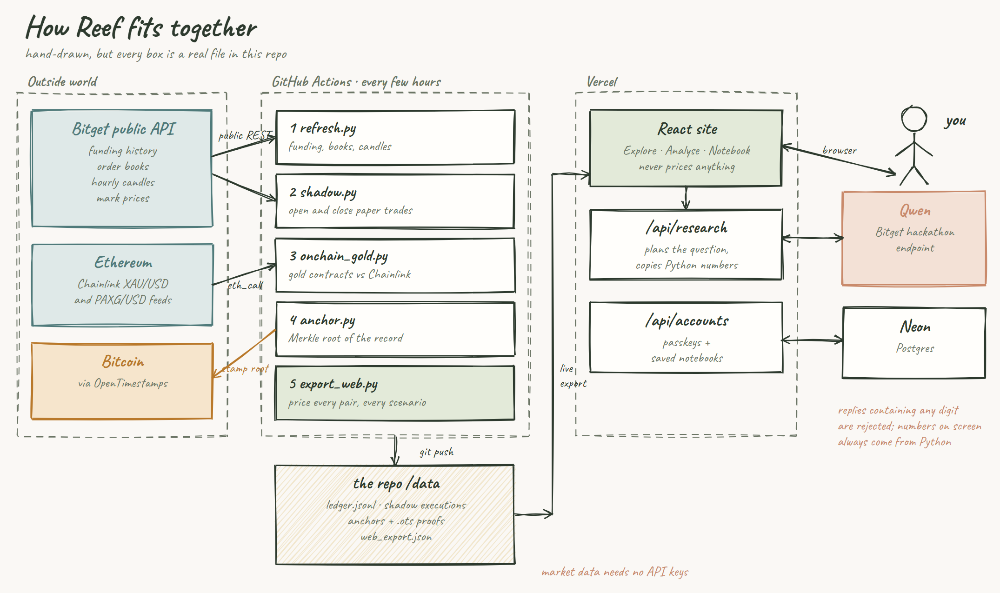

Three rules shape the design:

1. **Python computes, the browser displays.** [`export_web.py`](src/export_web.py) prices every pair, size and hold into `web/web_export.json`. The React site only reads that file and never prices anything.
2. **The AI explains; it never calculates.** Qwen, reached through the Bitget hackathon endpoint, turns a plain-English question into a validated plan. It then explains numbers that Python already produced. Any Qwen reply containing a digit is rejected before display. If Qwen is unavailable, a rules-based fallback keeps the desk working.
3. **The record is public and timestamped.** Market data, predictions, paper executions and Bitcoin anchors are all committed to `data/` by the live desk job. You can audit them without trusting the site.

The live desk runs [`desk_cycle.py`](src/desk_cycle.py) from [`.github/workflows/desk.yml`](.github/workflows/desk.yml). The job is scheduled hourly, but GitHub actually fires it every few hours: a median of 5.3h apart over the last 58 runs. Each cycle does this:

| Step | File | What it does |
|---|---|---|
| 1 | [`refresh.py`](src/refresh.py) | Funding history, order books, hourly candles. Public REST, no key. |
| 2 | [`shadow.py`](src/shadow.py) | Exits matured paper holds against the current book, records settlement marks, opens new holds with frozen predictions |
| 3 | [`onchain_gold.py`](src/onchain_gold.py) | Reads Chainlink XAU/USD and PAXG/USD straight from Ethereum by `eth_call`, then compares them with Bitget's gold contracts |
| 4 | [`anchor.py`](src/anchor.py) | Merkle root over the ledger and executions, stamped to Bitcoin with OpenTimestamps |
| 5 | [`export_web.py`](src/export_web.py) | Re-prices everything, grades shadow trades ([`score.py`](src/score.py)), runs the solver, writes the verdict-change feed |
| 6 | workflow | Commits `data/` and the export with `[skip ci]`. Vercel redeploys, and the site also reads the newest export straight from `main`. |

Refresh, shadow and export are critical: if any of them fails, the cycle fails loudly. The on-chain check and anchoring are best-effort and log a warning. More detail is in [ARCHITECTURE.md](ARCHITECTURE.md).

## How one answer is made

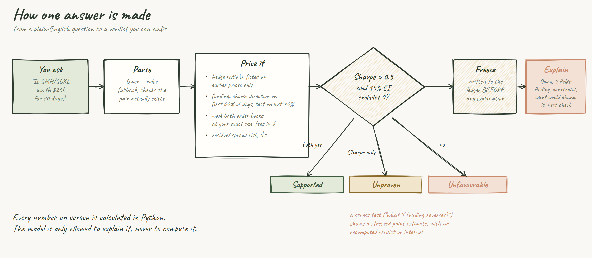

```
question ─► research plan + retained context (validated Qwen plan; rules fallback)
         ─► signed pair: A = −β·N, B = +N, β fitted on earlier prices only
         ─► funding holdout: direction chosen on the first 60% of complete days,
             evaluated on the untouched last 40%
         ─► cost: walk both books at the actual size, 6bp taker fee per fill, in dollars
         ─► risk: residual spread volatility, scaled by √t
         ─► verdict: SUPPORTED only if Sharpe > 0.5 AND its 95% interval excludes zero
         ─► ledger (append-only, Bitcoin-anchored) ─► explanation
```

| Verdict | Meaning |
|---|---|
| **Supported** | Clears the 0.5 bar, and the autocorrelation-adjusted 95% interval excludes zero. This is conditional support, not a promise. |
| **Unproven** | The point estimate clears the bar, but the interval crosses zero. This is not evidence of an edge. |
| **Unfavourable** | Does not clear the bar after cost and risk. |
| **Unpriced** | The book is too thin to fill the requested size, so no verdict is given. |

The verdict is written to the ledger **before** any explanation is generated, so the explanation cannot shape the number. Stress tests ("what if funding reverses?", "what if costs rise by half?") show a stressed point estimate. They are labelled separately and never get a recomputed verdict or interval.

## A tour of the product

### Explore: every pair at a glance

The desk prices about 27 pairs at your chosen size and hold. You can filter by verdict and open any pair. The Supported set changes as new funding and book data arrive, so the live site is the source of truth, not this page.

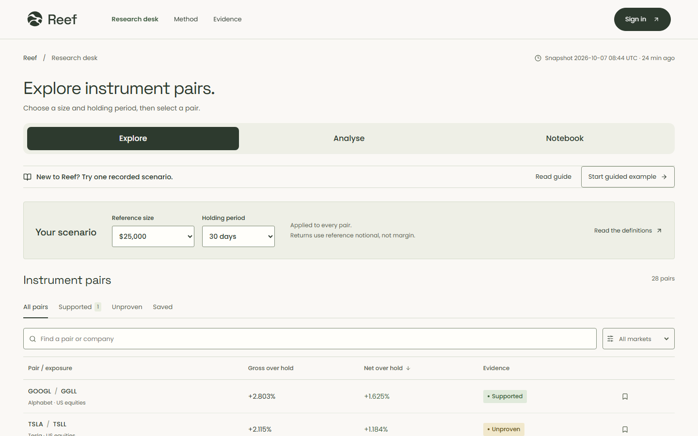

### Analyse: one pair, every assumption visible

Analyse shows, for one pair:

- the full cost waterfall
- the hedge ratio and the window it was fitted on
- the funding holdout split
- the 95% interval
- the solver's answer to "what would make this work?"

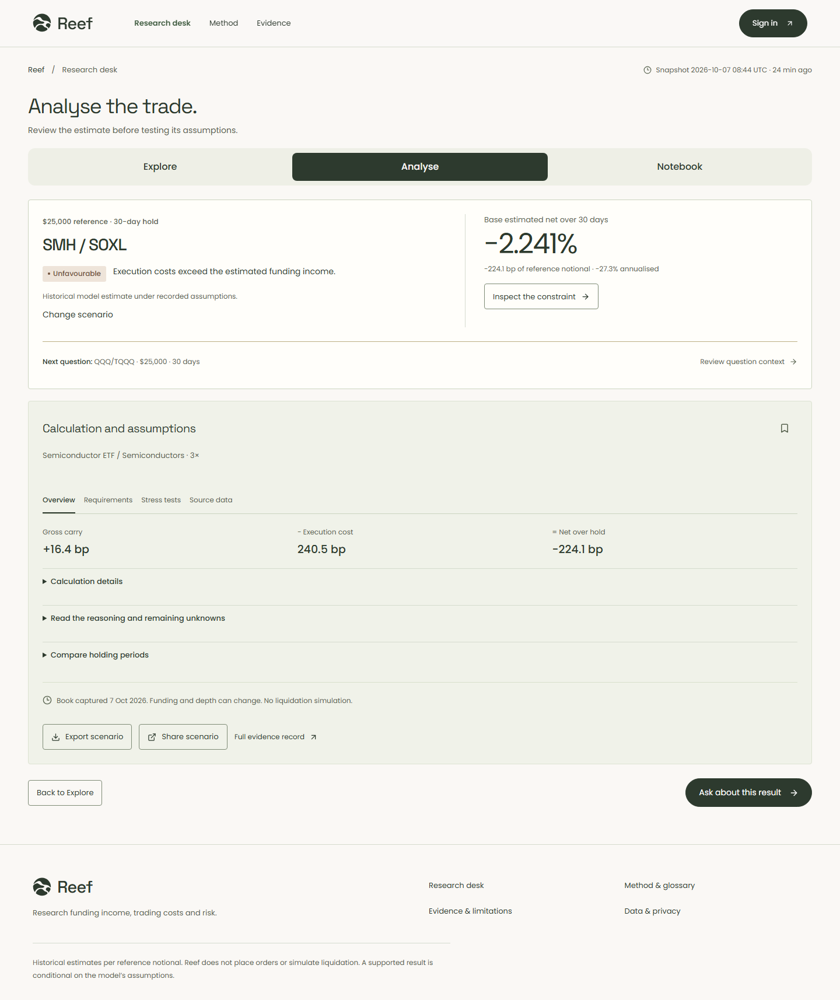

### Notebook: a research conversation

Ask in plain English. Follow-up questions keep the instruments, size, hold and stress from earlier turns. The screenshot shows a two-turn notebook. Turn 1 compares QQQ/TQQQ with SMH/SOXL at $25k for 30 days. Turn 2 asks "what if funding reverses?".

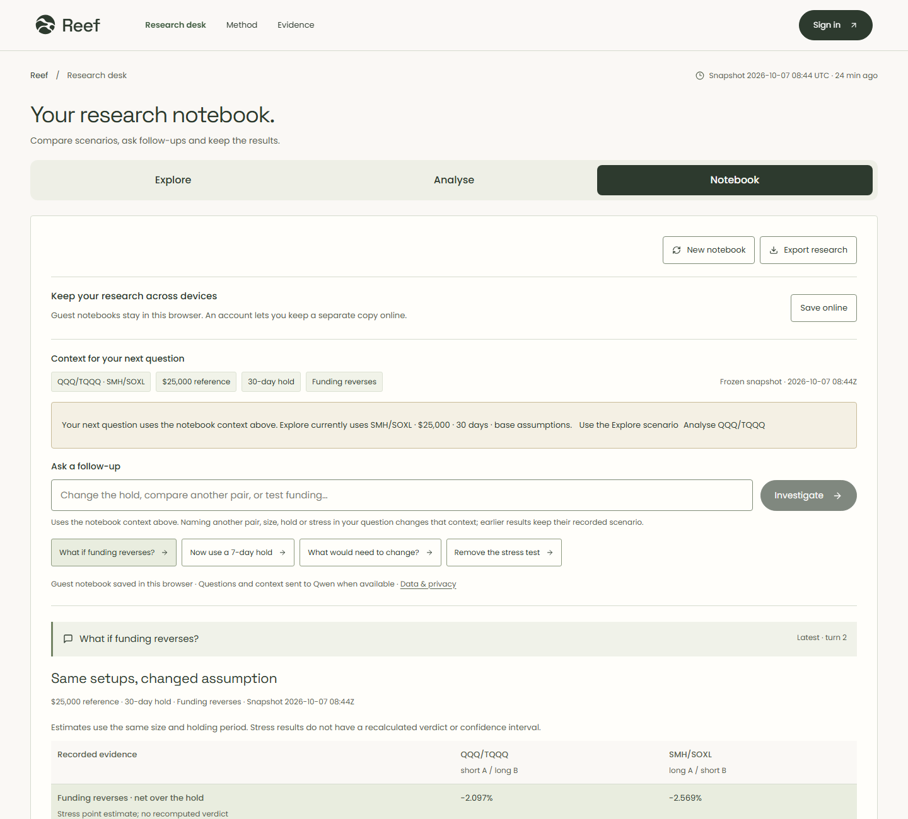

Try this sequence:

1. "Compare QQQ/TQQQ with SMH/SOXL at $25k for 30 days."
2. "What if funding reverses?"
3. "Now use a 7-day hold."
4. "What would need to change?"

Every turn selects existing Python results; nothing is repriced in the browser. You can sign in with a passkey to save notebooks to your account, which uses Neon Postgres. Notebooks export as dated JSON. Notebook turns are not added to the anchored prediction ledger.

### Evidence: the desk grading itself

The Evidence page shows:

- paper trades graded against later books
- prediction errors next to simple baselines
- the on-chain gold check
- the Bitcoin anchors
- a portable case study you can verify offline

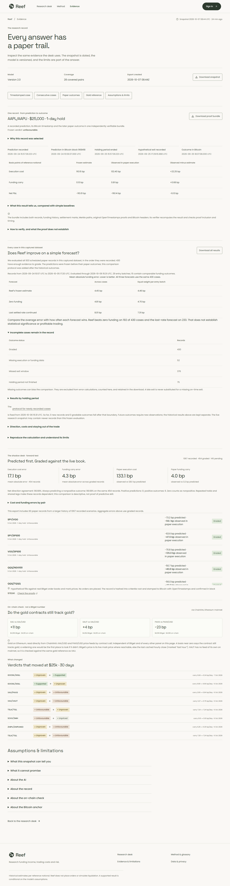

### Method

The Method page holds the full model in plain language, with the formulas the code implements.

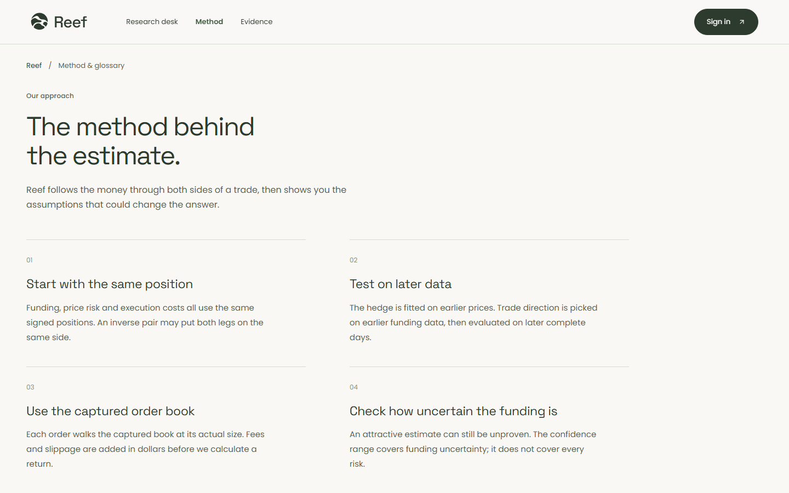

### On a phone

<p>
  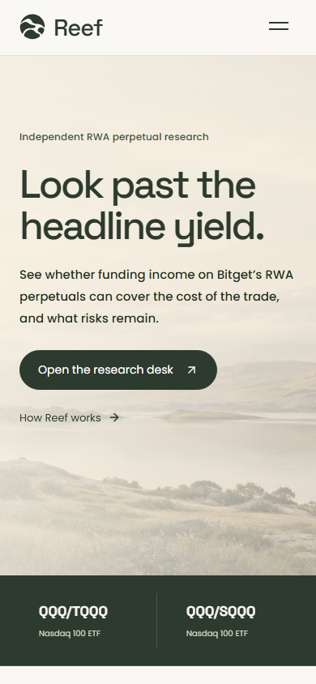
  &nbsp;&nbsp;
  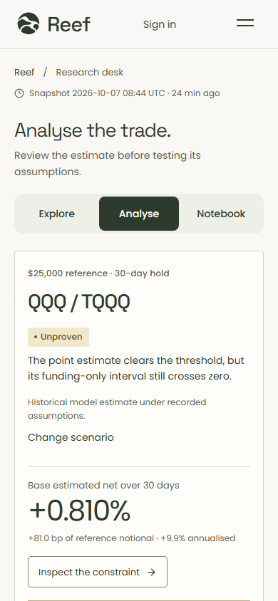
</p>

## The evidence loop

A backtest cannot tell you whether a predicted execution cost shows up in a *later* order book. The shadow desk tests exactly that, without ever placing an order.

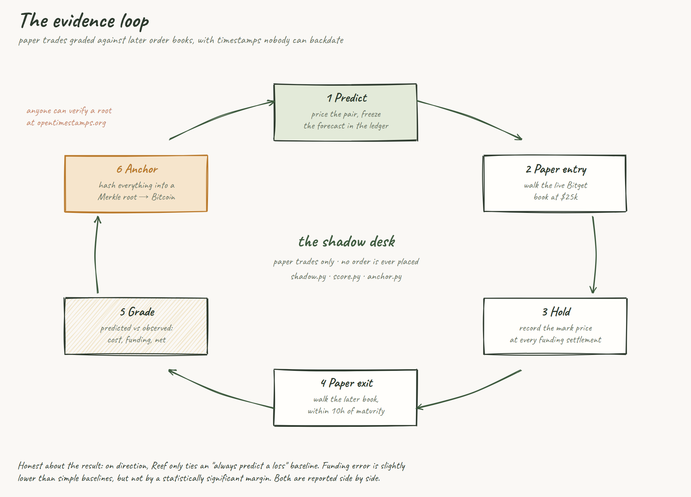

1. **Predict.** Price the pair and freeze the forecast in the ledger.
2. **Paper entry.** Walk the live Bitget book at $25k.
3. **Hold.** Record the exchange mark price at every funding settlement.
4. **Paper exit.** Walk the book again when the hold matures. The exit must happen within 10 hours of maturity, which covers every gap GitHub's scheduler has produced so far.
5. **Grade.** [`score.py`](src/score.py) compares predicted and observed cost, funding and net.
6. **Anchor.** Hash everything into a Merkle root and stamp it to Bitcoin.

New shadow trades also keep the full captured entry and exit books, stored by content hash. You can replay a completed fill exactly:

```bash
python src/book_evidence.py --replay "<timestamp>:<pair>:<hold>"
```

## Results so far, with baselines

The frozen 6 October evaluation covers all **933** scheduled paper records from 24 September to 5 October. They break down as follows:

| Outcome | Records | Meaning |
|---|---:|---|
| Graded | 430 | Entry, settlements and exit all captured |
| Missed exit window | 376 | The exit was not captured within the window (see below) |
| Missing data | 52 | An execution or funding record was absent |
| Pending | 75 | The hold had not matured at the cutoff |

**Why 376 exits were missed, and the fix.** The exit window was originally 3 hours. GitHub runs the scheduled desk a median 5.3h apart (p90 6.9h, max 9.7h), so most exits landed outside it. On 7 October the window was widened to 10 hours, which covers every observed gap. Records that already missed stay recorded as missed; nothing was rewritten. The full reasoning is in [DECISIONS.md, D-22](DECISIONS.md).

Results on the 430 graded cases:

| Metric | Reef | Baseline |
|---|---:|---|
| Mean abs. funding error | **4.45 bp** | 4.81 bp (predict zero funding) · 8.01 bp (repeat last rate) |
| Net direction agreement | 98.84% | 98.84% (always predict a nonpositive outcome) |
| Mean abs. execution-cost error | 17.43 bp | — |

**How to read this.** Reef's funding forecast beats both simple baselines on average. Holds overlap and pairs share legs, so these cases are not independent and the gap is not statistically significant. On direction, Reef **ties** the "always predict a loss" baseline. It shows no forecasting skill there, and the Evidence page shows that baseline side by side. All outcomes are hypothetical paper fills, not executed trades. Independent trader testing has not happened yet; [VALIDATION.md](VALIDATION.md) holds the protocol and records no invented participant results.

## Verify it yourself

Cached calculations and regression tests need no exchange key or account:

```bash
git clone https://github.com/IamHarrie-Labs/reef && cd reef
python src/test_accounting.py     # accounting tests: signed weights, dollar costs, scoring
python src/test_shadow.py         # shadow desk and Bitcoin anchor, end to end
python src/solve.py               # what would make each pair supported
python src/reef_index.py          # every pair, verdict and 95% interval
python src/onchain_gold.py        # gold contracts vs Chainlink, direct eth_call
python src/verdict.py "Is SMH/SOXL worth \$25k over 30 days?"
```

Check that a ledger row is included in an anchor, then that the anchor is in Bitcoin:

```bash
pip install opentimestamps-client
python src/anchor.py --verify "<ts>:<pair>:<hold>"   # Merkle proof for one ledger row
ots verify data/anchors/<id>.root.txt.ots             # the root is in Bitcoin
```

A confirmed proof shows the root existed by that Bitcoin block. A "predicted before the outcome" claim also needs that block time to come before the hold ended. Bitcoin timestamps are approximate to within a couple of hours.

To verify the portable case study (the earliest eligible completed record, not chosen for profit):

```bash
python -m pip install -r requirements-proof.txt
python src/case_study.py --verify data/case_study.json --online
```

## Run it locally

```bash
python src/export_web.py          # build web/web_export.json from data/
cd web && npm ci && npm run dev   # React + Vite site
```

The site works without any secrets. Two features need configuration:

- **Live Qwen** needs `BITGET_QWEN_API_KEY`, set as a Vercel or local env var. `BITGET_QWEN_BASE_URL` and `BITGET_QWEN_MODEL` are optional. Without the key, the rules-based planner answers.
- **Saved notebooks and passkeys** need `REEF_DATABASE_URL`, a Neon Postgres connection string, plus `BETTER_AUTH_SECRET` and `BETTER_AUTH_URL`.

## Repository map

```
src/model.py, capacity.py     signed-portfolio carry, cost and risk model
src/intervals.py              funding uncertainty and the shared verdict rule
src/solve.py                  what would make each pair supported
src/shadow.py, score.py       forward test against live books; grading
src/book_evidence.py          content-addressed captured books; fill replay
src/onchain_gold.py           gold perps vs Chainlink, read directly from Ethereum
src/anchor.py                 Merkle root of the record, stamped to Bitcoin
src/desk_cycle.py             one live-desk cycle (run by .github/workflows/desk.yml)
src/llm.py, verdict.py        question parsing, frozen evidence, explanation
src/export_web.py             the only thing the website reads
api/research.js               notebook research route (Qwen plan + no-digits guard)
api/accounts.js, notebooks.js passkey accounts and saved notebooks (Neon Postgres)
api/investigate.js            older single-scenario route, kept for compatibility
web/app/                      landing page and research desk (React + TypeScript + Vite)
web/research/core.mjs         research engine shared by the API, Vite and the Worker
data/                         market data, ledger, shadow executions, anchors
docs/images/                  screenshots and the hand-drawn diagrams in this README
archive/                      superseded exploratory scripts, kept for history
```

## What Reef does not claim

- **Shadow fills are hypothetical.** They walk real books and use real mark prices, but a paper order never moves the book.
- **The funding history is short.** The chronological holdout covers a few weeks of settlements, and the live desk keeps extending it.
- **Anchoring proves timing, not correctness.** It shows when a row existed. It does not stop a row being withheld before its first anchor.
- **The confidence interval covers funding uncertainty only.** Beta, cost and model-selection uncertainty are excluded, so the true interval is wider.
- **Returns are per reference notional, not return on margin.** Liquidation and collateral are not simulated.
- **Not yet tested by independent traders.**

The full list is in [LIMITATIONS.md](LIMITATIONS.md). Every model change, including two bugs caught during the build and why their old numbers were withdrawn rather than quietly replaced, is in [DECISIONS.md](DECISIONS.md).

---

The diagrams were drawn with [rough.js](https://roughjs.com) in the Caveat typeface. The screenshots are of the live site on 7 October 2026.

MIT licensed. Research, not advice. Reef never places an order.
